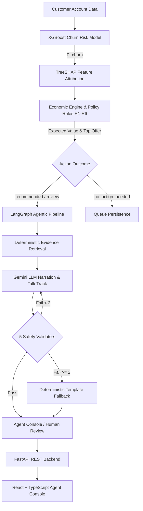

# Telecom-Customer-Churn-Prediction-And-Retention-Recommendation
# Telecom Customer Churn Prediction & Retention Recommendation

An end-to-end, policy-governed retention platform that identifies telecom customers at risk of churn, calculates economically optimal retention offers, generates grounded agent talk tracks via an LLM agentic graph, and provides a real-time console for call center agents.

---

## Architecture Overview



---

## Key Features & Highlights

### 1. Machine Learning & Economics (`ml/`)
- **Calibrated Churn Scoring**: Trained XGBoost model predicting continuous churn probability ($P_{\text{churn}}$).
- **Explainable AI (TreeSHAP)**: Identifies top positive and negative account churn drivers without making unverified causal claims.
- **Expected Value (EV) Pricing**: Ranks retention offers by net return:
  $$\text{EV} = (\Delta P_{\text{prior}} \times \text{CLTV}) - \text{Offer Cost}$$
- **$20 Minimum EV Tripwire**: Ensures offers exceed agent outreach labor costs ($7/call buffer).
- **6 Policy Rules (R1–R6)**: Enforces eligibility criteria, contract prerequisites, exclusivity, and budget constraints.
- **Data Leakage Quarantine**: Strict input gates prevent target leakage (`Churn Label`, `Churn Score`, `Churn Reason`).

### 2. Agentic LLM Workflow with Deterministic Guardrails
- **9-Node LangGraph Pipeline**: Coordinates scoring, attribution, lever extraction, offer decisioning, retrieval, narration, and human review.
- **5 Deterministic Safety Validators**:
  - `V-OFFER`: Rejects unapproved or unpriced offers.
  - `V-MONEY`: Rejects hallucinated discount amounts or prices.
  - `V-CITE`: Validates knowledge base citations (`DELTA-*`, `LEVER-*`).
  - `V-CAUSAL`: Rejects unsubstantiated causal claims (e.g. "guaranteed to stay").
  - `V-SCHEMA`: Enforces strict character boundaries and JSON structure.
- **Dual-Model Fallback Chain**: `gemini-3.5-flash-lite` $\rightarrow$ `gemini-3.1-flash-lite` on transport/quota errors $\rightarrow$ deterministic template fallback on repeated validation failure.

### 3. High-Performance REST API (`backend/`)
- **FastAPI Service**: Serves dynamic queue state, customer details, KPIs, and the offer catalog.
- **Live On-Demand Generation**: `POST /api/customers/{id}/narrate` runs the real LangGraph pipeline live with timeout protection and async cache autowarming.
- **Interactive Sandbox Scoring**: `POST /api/score` allows real-time ad-hoc customer scoring and offer simulation.
- **Action Audit Logging**: Full audit trail recording agent decisions (`approve`, `edit`, `reject` with reason codes).

### 4. Agent-Facing Retention Console (`retention-console-frontend/`)
- **Priority Queue**: Dynamic queue table with status filters (`Pending`, `Approved`, `Rejected`), customer search, and shift capacity tracking.
- **Customer Detail & Talk Track**: Interactive view displaying tenure, contract, EV formula breakdown, SHAP drivers, policy audit trace, and generated talk tracks.
- **Live Note Regeneration**: On-demand note regeneration button with progress state.
- **Customer Simulation Sandbox**: 19-field interactive form with conditional dependency logic and instant churn/EV scoring.
- **Executive Analytics Dashboard**: Portfolio KPIs, churn probability distribution, and offer recommendation mix charts.
- **Zero-Backend Development (MSW)**: Full offline UI simulation via Mock Service Worker.

---

## Repository Structure

```
Telecom-Customer-Churn-Prediction-And-Retention-Recommendation/
├── ml/                                 # Machine learning models, LangGraph pipeline & CLI tools
│   ├── artifacts/                      # Pickled models, registries, and queue artifacts
│   ├── data/                           # Telco dataset, offer catalog (YAML), and knowledge base
│   ├── samples/                        # 34 curated test cases + 200-customer batch
│   ├── src/                            # LangGraph graph, decision engine, validators, clients
│   ├── tests/                          # 285+ pytest unit and control-flow tests
│   ├── .env.example                    # Environment template for Gemini API key
│   ├── README.md                       # Comprehensive ML & Graph technical guide
│   └── requirements.txt                # Python ML dependencies
│
├── backend/                            # FastAPI backend service
│   ├── app/                            # API routes, queue state, caching, and score handlers
│   ├── tests/                          # API contract & endpoint tests
│   ├── README.md                       # Backend service documentation
│   ├── requirements.txt                # Web service dependencies
│   ├── run.bat                         # Windows launch script
│   └── run.sh                          # Linux / macOS launch script
│
└── retention-console-frontend/         # Frontend web application
    ├── api-contract/                   # Canonical API contract JSON schemas and fixtures
    └── frontend/                       # React 18 + TypeScript + Vite + Tailwind CSS console
        ├── src/                        # Pages (Queue, Customer, Score, Dashboard, Catalog)
        ├── README.md                   # Frontend setup & development guide
        └── package.json                # Frontend package dependencies
```

---

## Quick Start

### 1. Prerequisites
- Python 3.10+
- Node.js 18+ and npm

### 2. Environment Setup

#### A. Install Python Dependencies
```bash
# Install ML and Backend dependencies
pip install -r ml/requirements.txt
pip install -r backend/requirements.txt
```

#### B. Configure Environment Variables
Copy `.env.example` in the `ml/` directory to `.env`:
```bash
cp ml/.env.example ml/.env
```
Open `ml/.env` and set your preferred configuration:
```env
# Get a key from https://aistudio.google.com/apikey
GEMINI_API_KEY=your-gemini-api-key-here

# 'gemini' for real LLM calls; 'fake' for offline deterministic stub (no API key needed)
NARRATION_PROVIDER=gemini
```

---

### 3. Running the Services

#### Step 1: Start the Backend API (Port 8000)
From the repository root:

**On Windows (PowerShell / CMD):**
```powershell
cd backend
.\run.bat
```
*(Or run with the fake offline provider: `.\run.bat fake`)*

**On Linux / macOS:**
```bash
cd backend
./run.sh
```
The API is available at `http://localhost:8000` (Health check: `http://localhost:8000/api/health`).

#### Step 2: Start the Frontend Console (Port 5173)
In a second terminal:
```bash
cd retention-console-frontend/frontend
npm install
npm run dev
```
Open your browser at `http://localhost:5173`.

---

## CLI & Testing Suite

### Run ML Diagnostics & Tests (No API Key Required)
```bash
# Check Python versions, artifact integrity, and test all 9 graph nodes
python -m src.doctor

# Run a single customer through the LangGraph pipeline
python -m src.run_one samples/01_recommended_top_value.json

# Test hallucination detection and retry cycle offline
python -m src.run_one samples/01_recommended_top_value.json --script invented_discount,ok

# Run the full test suite across all subsystems
pytest ml/tests -q
pytest backend/tests -q
cd retention-console-frontend/frontend && npm test
```

---

## Detailed Subsystem Documentation

For deep technical details on individual components, consult the subsystem guides:
- 📖 [**ML & LangGraph Documentation**](ml/README.md) — Node execution, 5 validators, sensitivity analysis, evaluation metrics, and decision rules.
- 📖 [**Backend Service Documentation**](backend/README.md) — Endpoint specifications, dynamic queue state, autowarming, and error contracts.
- 📖 [**Frontend Console Documentation**](retention-console-frontend/frontend/README.md) — UI architecture, MSW offline mode, design tokens, and components.